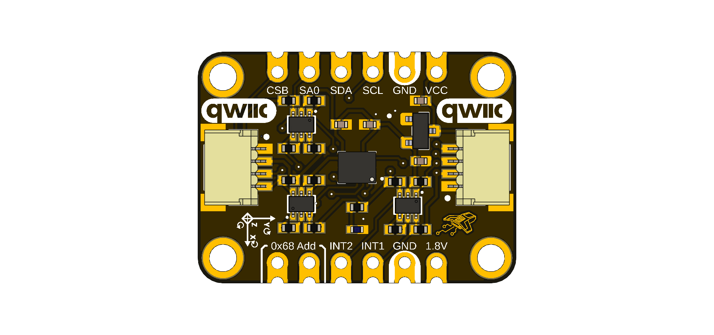

# DevLab: I²C Bosch BMI323 IMU

The DevLab I²C Bosch BMI323 IMU (Mfr. Part # **UE0132**) is a compact
six-axis inertial measurement module. It combines a 16-bit, three-axis
accelerometer, a 16-bit, three-axis gyroscope, and an integrated digital
temperature sensor.

The module supports I²C and SPI communication, provides two programmable
interrupt outputs, and includes onboard voltage regulation and bidirectional
level shifting for use with 3.3 V and 5 V host systems. Its DevLab form factor
offers two Qwiic®/STEMMA QT-compatible connectors, castellated pads, and a
dedicated SPI connector.

  
  
<em>DevLab I²C Bosch BMI323 IMU</em>

### Quick Setup

## Key Features

- Bosch BMI323 six-axis IMU
- 16-bit, three-axis accelerometer with ±2 g, ±4 g, ±8 g, and ±16 g ranges
- 16-bit, three-axis gyroscope with ±125 dps, ±250 dps, ±500 dps,
  ±1000 dps, and ±2000 dps ranges
- Output data rates up to 6.4 kHz
- Integrated digital temperature sensor
- Programmable filtering, averaging, FIFO, and motion features
- I²C Fast-mode Plus (up to 1 MHz) and SPI (up to 10 MHz)
- Default 7-bit I²C address `0x69`; selectable address `0x68`
- Two programmable interrupt outputs (`INT1` and `INT2`)
- 3.3 V to 5.5 V module supply input
- Onboard 1.8 V regulator and bidirectional logic-level shifting
- Two Qwiic®/STEMMA QT-compatible I²C connectors
- Castellated pads and a six-pin JST SH connector for SPI

## Specifications

| Parameter | Value |
| --- | --- |
| Sensor | Bosch BMI323 |
| Measurement axes | 3-axis accelerometer + 3-axis gyroscope |
| Module supply (`VCC`) | 3.3 V to 5.5 V |
| Operating temperature | -40 °C to +85 °C |
| Interfaces | I²C and SPI |
| I²C addresses | `0x69` (default), `0x68` (address jumper closed) |
| Maximum I²C clock | 1 MHz |
| Maximum SPI clock | 10 MHz |
| Device ID | `0x43` from register `0x00` |
| Board dimensions | 25.40 mm × 17.80 mm |

## Quick Start

For an I²C connection:

1. Connect `VCC` to a 3.3 V or 5 V supply.
2. Connect `GND` to the host ground.
3. Connect `SDA` and `SCL` to the host I²C bus.
4. Scan for address `0x69`.
5. Install the
   [DevLab BMI323 Arduino library](https://github.com/UNIT-Electronics-MX/unit_library_devlab_bmi323)
   and open its basic I²C example.

See the [software guide](software/README.md) for installation and usage notes.

## Applications

- Wearable electronics and activity tracking
- Robotics, drones, and motion-control systems
- Gesture recognition and human-machine interfaces
- Tilt, inclination, and vibration measurement
- IoT sensor nodes and asset tracking
- Industrial monitoring
- Embedded-systems education and rapid prototyping

## Repository Contents

| Path | Description |
| --- | --- |
| [`hardware/`](hardware/README.md) | Pinout, electrical information, schematic, topology, and dimensions |
| [`software/`](software/README.md) | Software setup and basic usage |
| [`docs/`](docs/) | Generated documentation |

## Resources

- [Product reference manual](hardware/unit_datasheet_v_1_0_0_devlab_i2c_bosch_bmi323_imu.pdf)
- [Hardware guide](hardware/README.md)
- [Schematic](hardware/unit_sch_v_1_0_0_0_ue0132_bmi323.pdf)
- [Pinout diagram](hardware/unit_pinout_v_1_0_0_0_ue0132_bmi323_en.pdf)
- [DevLab BMI323 Arduino library](https://github.com/UNIT-Electronics-MX/unit_library_devlab_bmi323)

## License

See the repository [license](LICENSE).

  UNIT Electronics

