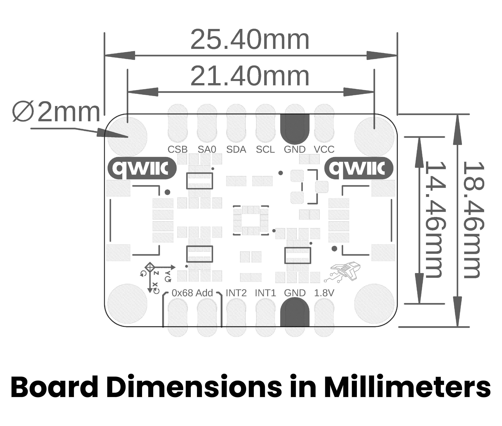

# Hardware

This guide describes the hardware interfaces and operating limits of the
DevLab I²C Bosch BMI323 IMU, Mfr. Part # **UE0132**.

## Hardware Resources

  <a href="./unit_sch_v_1_0_0_0_ue0132_bmi323.pdf">
     
    Schematic
  </a>

## Pinout

  <a href="./unit_pinout_v_1_0_0_0_ue0132_bmi323_en.pdf">
     
    Pinout diagram
  </a>

### Signals

| Signal | I²C function | SPI function | Description |
| --- | --- | --- | --- |
| `VCC` | Supply | Supply | Module input supply, 3.3 V to 5.5 V |
| `GND` | Ground | Ground | Common power and signal reference |
| `SCL/SCK` | Serial clock | Serial clock | Level-shifted host clock |
| `SDA/MOSI` | Serial data | Controller output / sensor input | Level-shifted host data |
| `SA0/MISO` | Address selection | Sensor output / controller input | Selects the I²C address or carries SPI MISO |
| `CSB` | Keep high | Chip select | Active-low SPI chip select |
| `INT1` | Interrupt output | Interrupt output | Programmable BMI323 interrupt |
| `INT2` | Interrupt output | Interrupt output | Second programmable BMI323 interrupt |
| `1V8` | Internal rail | Internal rail | Regulated 1.8 V test/reference point; do not use to power external loads |

The two four-pin JST SH connectors carry `VCC`, `GND`, `SDA`, and `SCL` and
are compatible with Qwiic® and STEMMA QT cabling. The six-pin JST SH connector
on the bottom of the board exposes `SCK`, `MOSI`, `MISO`, `CSB`, `VCC`, and
`GND` for SPI.

### I²C Address Selection

| Address jumper | 7-bit address |
| --- | --- |
| Open (default) | `0x69` |
| Closed | `0x68` |

The `SA0` label on the board corresponds to the BMI323 `SDO` pin. In I²C mode
it selects the address; in SPI mode it becomes `MISO`.

> **SPI note:** Remove the `0x68 Add` jumper shunt before using SPI.

## Recommended Operating Conditions

| Symbol | Description | Min | Typ | Max | Unit |
| --- | --- | ---: | ---: | ---: | --- |
| `VCC` | Module input supply | 3.3 | 5.0 | 5.5 | V |
| `VDD` | BMI323 supply | 1.71 | 1.8 | 3.6 | V |
| `VDDIO` | BMI323 I/O supply | 1.2 | 1.8 | 3.6 | V |
| `TA` | Ambient operating temperature | -40 | — | +85 | °C |
| `fSCL` | I²C clock frequency | — | — | 1 | MHz |
| `fSCK` | SPI clock frequency | — | — | 10 | MHz |

## Functional Overview

The Bosch BMI323 integrates a 16-bit triaxial accelerometer, a 16-bit triaxial
gyroscope, and a digital temperature sensor. Both motion sensors support output
data rates up to 6.4 kHz, programmable ranges, filtering, averaging, power
modes, and FIFO storage.

Communication signals and both interrupt outputs pass through onboard
bidirectional level shifters. A ME6206A18XG regulator generates the sensor's
1.8 V supply from `VCC`.

The device ID register at address `0x00` returns `0x43` in its least significant
byte when communication is working.

## Board Topology

  <a href="./resources/unit_topology_v_1_0_0_ue0132_i2c_bosch_bmi323_imu.png">
     
    Board topology
  </a>

| Ref. | Description |
| --- | --- |
| `IC1` | Bosch BMI323 six-axis inertial measurement unit |
| `U1` | ME6206A18XG 1.8 V low-dropout regulator |
| `Q1` | BSS138AKDW bidirectional level shifter for `SCL/SCK` and `SDA/MOSI` |
| `Q2` | BSS138AKDW bidirectional level shifter for `CSB` and `SA0/MISO` |
| `Q3` | BSS138AKDW bidirectional level shifter for `INT1` and `INT2` |
| `D1` | Red power indicator LED |
| `J1`, `J3` | Four-pin JST SH Qwiic®/STEMMA QT-compatible I²C connectors |
| `J2` | 1×6, 2.54 mm castellated header for power and communication |
| `J4` | 1×6, 2.54 mm castellated header for interrupts and auxiliary signals |
| `J7` | Six-pin JST SH connector for SPI |

## Dimensions

The board measures **25.40 mm × 17.80 mm**. The four mounting holes are 2 mm
in diameter.

  <a href="./resources/unit_dimensions_v_1_0_0_ue0132_i2c_bosch_bmi323_imu.png">
     
    Mechanical dimensions
  </a>

## Applications

- Wearable electronics and activity recognition
- Robotics, stabilization, and navigation
- Motion control and gesture recognition
- Tilt, inclination, and vibration measurement
- IoT and industrial monitoring
- Embedded prototyping and education

## References

- [Product reference manual](./unit_datasheet_v_1_0_0_devlab_i2c_bosch_bmi323_imu.pdf)
- [Schematic](./unit_sch_v_1_0_0_0_ue0132_bmi323.pdf)
- [Pinout diagram](./unit_pinout_v_1_0_0_0_ue0132_bmi323_en.pdf)
- [DevLab BMI323 Arduino library](https://github.com/UNIT-Electronics-MX/unit_library_devlab_bmi323)
